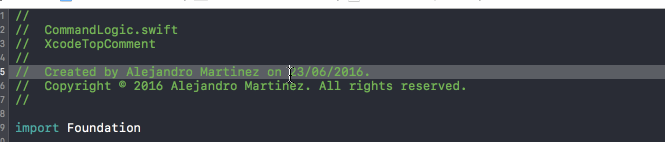

# XcodeTopComment
Xcode Source Editor Extension to remove or modify the top comment of a file

## Commands

- Change date to Today: *for when you have changed the file so much that it has become new file*
- Remove top comment: *for when you realize that those top comments are useless*

## How to use:

1. Download Xcode Version 8.0 beta (8S128d), open it and let it install all the required components.
2. If you are not using macOS Sierra run `sudo /usr/libexec/xpccachectl` and reboot your Mac (as per Xcode Release Notes)
3. Open this project, deal with codesigning and run the extension scheme selecting Xcode as a target.
4. Now you can just open a project, and use the new commands in the Editor menu!
